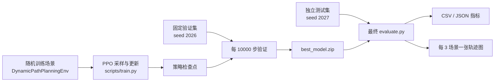

# USV 动态路径规划项目设计文档

## 1. 文档信息

- 文档状态：基于当前代码的现状设计与改进建议
- 适用代码：`envs/`、`scripts/`、`configs/validation_scenarios_30.json`、`configs/independent_test_scenarios_30.json`
- 更新日期：2026-09-09
- 目标读者：算法开发者、实验复现人员、项目评审人员

本文负责总体设计目标、能力边界与设计约束；实施顺序和进度统一维护在 [PROGRESS.md](PROGRESS.md)。本文首先描述基线实现，再分析设计缺陷并给出目标架构。凡标记为“建议”的内容均尚未在代码中实现。

第一轮更新说明：第 3–10 节保留第零轮/legacy 的基线说明，不能当作第一轮默认 D 阶段的完整规格。当前训练默认 D：固定半径、船体速度编码、类型约束下的二维随机会遇与混合布局。当前设计契约见第 11 节，具体实施计划与完成状态见 [PROGRESS.md](PROGRESS.md)，实际证据见 [第一轮验收记录](ROUND_ONE_ACCEPTANCE.md)及后续轮次验收记录；legacy 模式仍用于兼容旧测试。

## 2. 项目目标与边界

### 2.1 当前目标

本项目使用 Stable-Baselines3 PPO 训练单艘 USV，在二维连续空间中完成从左侧起点到右侧目标点的导航，同时避开两个圆形静态障碍物和一个动态障碍物。第一轮默认 D 阶段中，动态障碍采用二维匀速运动，会遇类型和风险分层后随机生成；原竖直往返任务保留在 legacy/A/B 模式中。

当前项目适合作为以下用途：

- 验证 Gymnasium 连续控制环境的基本实现；
- 研究简单动态障碍场景中的端到端强化学习避障；
- 比较奖励、观测和场景分布对 PPO 策略的影响；
- 输出固定场景指标和轨迹图进行定性分析。

### 2.2 当前不覆盖的能力

- 真实船舶水动力、风浪流和执行器延迟；
- COLREGs 海上避碰规则；
- 多船、多智能体或通信；
- 传感器噪声、遮挡、跟踪误差；
- 任意数量和任意运动模式的障碍物；
- 对真实 USV 的安全部署保证。

因此，当前结果只能说明策略在此仿真分布中的表现，不能直接证明其具备真实海上动态避障能力。

## 3. 当前系统架构



主要模块职责如下：

| 模块 | 当前职责 |
|---|---|
| `envs/dynamic_path_env.py` | 场景采样、运动学、观测、奖励、终止判定、渲染 |
| `envs/scenario_dataset.py` | 固定场景生成、几何校验、基线仿真、哈希校验 |
| `scripts/train.py` | PPO 配置、训练、固定场景选优、检查点和奖励曲线 |
| `scripts/evaluate.py` | 确定性评估、指标汇总、轨迹图输出 |
| `scripts/test_environment.py` | 环境接口和基本数值断言 |
| `scripts/test_fixed_scenarios.py` | 固定数据集完整性和可复现性断言 |

## 4. 环境设计

### 4.1 地图与实体

| 参数 | 当前值 |
|---|---:|
| 地图尺寸 | `100 m × 100 m` |
| 时间步长 | `0.2 s` |
| 最大回合步数 | `600` |
| USV 半径 | `1.0 m` |
| 目标判定半径 | `3.0 m` |
| 最大线速度 | `3.0 m/s` |
| 最大角速度 | `π/4 rad/s` |
| 最大线加速度 | `1.5 m/s²` |
| 最大角加速度 | `π/4 rad/s²` |
| 静态障碍数量 | 2 |
| 动态障碍数量 | 1 |

### 4.2 USV 运动学

动作为 `a=(a_v,a_ω)∈[-1,1]²`，映射为：

```text
v_target = (a_v + 1) / 2 × v_max
ω_target = a_ω × ω_max
```

目标速度先经过加速度限幅，再使用当前航向完成平移，最后更新航向：

```text
x(t+1) = x(t) + v(t+1) × dt × cos(θ(t))
y(t+1) = y(t) + v(t+1) × dt × sin(θ(t))
θ(t+1) = normalize(θ(t) + ω(t+1) × dt)
```

这是一种简化 Unicycle 模型，不含侧滑、惯性耦合和水动力。

### 4.3 场景模式

环境支持三种模式：

1. `random_train`：每次 `reset()` 拒绝采样一个训练场景；
2. `fixed_test`：从 JSON 按 `scenario_index` 精确加载场景；
3. `default_fixed`：未传场景文件且关闭随机化时使用代码内置地图。

随机训练场景具有以下约束：

- 起点位于左侧、目标位于右侧；
- 两个静态障碍物按横向区域分布；
- 至少一个静态障碍物与膨胀后的起终点直线相交；
- 动态障碍物只沿世界坐标系 `y` 轴运动；
- 按名义 `2 m/s` 的 USV 估计，动态障碍物会进入航线中心距离 `8 m` 的走廊。

动态障碍物到达上下边界后镜像反弹。碰撞以实体半径和判断，安全奖励目前以中心距离判断。

## 5. 智能体接口

### 5.1 观测空间

观测为固定 16 维 `float32` 向量，范围裁剪到 `[-1,1]`：

| 索引 | 内容 | 坐标/归一化 |
|---:|---|---|
| 0–2 | 目标中心距离、相对方位 `sin/cos` | 距离除地图对角线，方位为船体相对角 |
| 3–5 | 静态障碍物 1 中心距离、相对方位 | 同上 |
| 6–8 | 静态障碍物 2 中心距离、相对方位 | 同上 |
| 9–11 | 动态障碍物中心距离、相对方位 | 同上 |
| 12–13 | 动态障碍物与 USV 的相对速度 | 世界坐标系 `x/y`，除以最大速度和 |
| 14–15 | USV 当前线速度、角速度 | 分别除以上限 |

静态障碍物按生成时的横向区域固定编号，不按实时距离排序。

### 5.2 动作空间

- `action[0]`：期望线速度，映射范围 `[0,3] m/s`；
- `action[1]`：期望角速度，映射范围 `[-π/4,π/4] rad/s`。

USV 不能主动倒车。评估使用 `deterministic=True`，训练时由 PPO 的随机策略采样动作。

### 5.3 终止语义

以下事件返回 `terminated=True`：

- 到达目标；
- 与静态障碍物碰撞；
- 与动态障碍物碰撞；
- USV 圆形外轮廓越过地图边界。

达到最大步数且未终止时返回 `truncated=True`。同一步事件的优先级为：成功、静态障碍物 1、静态障碍物 2、动态障碍物、越界。

## 6. 奖励设计

当前单步奖励为：

```text
r = r_progress + r_static + r_dynamic - 0.05 + r_terminal
```

各部分为：

- 进展：`10 × (上一时刻目标中心距离 - 当前目标中心距离)`；
- 静态安全：中心距离小于 `7 m` 时给予线性负奖励，两个障碍物求和；
- 动态安全：中心距离小于 `8 m` 时给予最大幅度为 `-2` 的线性负奖励；
- 时间：每步 `-0.05`；
- 成功：`+200`；
- 静态碰撞：`-120`；
- 动态碰撞：`-150`；
- 越界：`-100`；
- 超时：没有额外终端惩罚。

## 7. 学习与模型选择

当前使用 PPO `MlpPolicy`：

| 参数 | 当前值 |
|---|---:|
| 策略网络 | `16 → 64 → 64 → action distribution` |
| 价值网络 | `16 → 64 → 64 → scalar value` |
| 激活函数 | Tanh |
| 学习率 | `1e-4` |
| rollout 长度 | `2048` |
| batch size | `64` |
| 每批更新轮数 | `10` |
| `gamma` | `0.99` |
| `gae_lambda` | `0.95` |
| clip range | `0.2` |
| entropy coefficient | `0.01` |

每 10,000 环境步在固定验证集上执行确定性评估。最佳模型按以下字典序选择：

1. 成功率更高；
2. 碰撞率更低；
3. 成功回合路径效率更高；
4. 平均奖励更高。

## 8. 评估与产物

`evaluate.py` 默认只接受声明为 `test` 的独立场景集，并在每个固定场景上运行一次确定性回合，生成：

- `results/episode_results.csv`：逐场景结果；
- `results/summary_metrics.json`：整体指标；
- `results/metrics_by_scenario_type.csv`：分类指标；
- `results/trajectory_sheets/*.png`：每 3 个场景一张完整轨迹与最近会遇图。

历史结果记录的 `28/30` 使用了参与选模的数据，不能作为独立泛化性能结论。使用当前遗留 `final_model.zip` 在新独立测试集（seed 2027）上的核验结果为 `15/30`，成功率 `50.0%`，Wilson 95% 区间约为 `[33.2%, 66.8%]`。这进一步说明拆分数据的必要性；该结果只评价遗留模型，不代表重新按新流程训练后的水平。

新流程将每次训练写入 `runs/<run_id>/`，模型、配置、代码状态、依赖版本、验证集哈希、模型哈希、日志和评估结果具有统一身份。评估默认创建隔离输出目录，并写入 `evaluation_metadata.json`。

## 9. 当前设计不合理之处

### 9.0 历史问题与设计约束的阅读边界

以下各节保留 legacy 流程的问题、原因与修复思路，用于解释设计约束，不作为当前进度台账；其中旧模型步数和成绩是历史审查示例，不是最新实验结果。早期修复清单已迁入 [进度文档](PROGRESS.md)，后续完成证据以各轮验收记录为准。当前默认 D 的契约以第 11 节为准，旧根目录产物仍是遗留数据。

### 9.1 P0：验证集与测试集相同（已修复）

训练回调反复使用 `configs/test_scenarios_30.json` 选择最佳训练步数，最终又在同一批场景上报告测试成绩。模型虽然没有用这些场景做梯度更新，但最佳检查点已经针对它们被反复挑选，形成模型选择泄漏。

影响：`93.33%` 是“被用于选优的数据上的表现”，会高估真正未见场景的泛化能力。

修复：训练默认使用 `validation_scenarios_30.json`，最终评估默认使用互不重叠的 `independent_test_scenarios_30.json`；训练回调拒绝非 validation split，正式评估默认拒绝非 test split。

### 9.2 P0：模型、指标和图片缺少同一实验身份（新流程已修复）

`best_model.zip`、`final_model.zip`、评估 JSON、训练日志和图片都写入固定路径并被后续运行覆盖。当前 `models/best/selection_metrics.json` 记录的是 180,000 步、23/30；而 `results/summary_metrics.json` 记录的是 28/30，说明现有“最佳模型元数据”和“结果摘要”并非同一次模型评估。

影响：仅看文件名无法回答某张图、某个指标究竟对应哪个模型、seed、奖励版本或代码版本。

修复：每次运行创建唯一 `run_id` 目录，并在模型和结果旁保存配置、模型 SHA-256、场景集哈希、seed、代码提交号、依赖和时间戳。旧根目录模型没有自动迁移，仍需视为遗留产物。

### 9.3 P0：观测不能完整表达碰撞几何和边界风险

障碍物半径参与碰撞判定且在不同场景中变化，但 16 维观测只包含中心距离，没有半径或表面净空。两个中心距离相同、半径不同的场景对策略看起来相同，实际碰撞边界却不同。观测也没有地图边界距离，因此接近边界时策略无法直接识别越界风险。

影响：环境对智能体而言存在部分可观测性，增加学习难度并限制安全泛化。

建议：输入表面净空或显式半径，并加入船体坐标系下的四向边界距离。修改观测维度后必须从头训练，旧模型不兼容。

### 9.4 P1：观测混用了船体坐标系和世界坐标系

目标及障碍物方位使用船体相对角，但动态相对速度使用世界坐标系 `x/y`。同一个局部会遇关系整体旋转后，观测不再等价。

影响：破坏旋转不变性，网络需要额外学习航向与世界速度分量之间的变换，可能促成固定向上转的方向偏置。

建议：将相对速度旋转到船体坐标系，或统一使用径向/切向速度、TCPA/DCPA 等会遇特征。

### 9.5 P1：奖励对路径效率和绕行方向区分不足

进展奖励在完整回合上近似望远镜求和，主要由初始和最终目标距离决定。只要最终到达，大幅绕行和短路径的累计进展奖励可能接近；每步 `-0.05` 又较弱。现有结果中成功轨迹平均长度约 `92.63 m`，而固定场景平均起终点直线距离约 `81.48 m`。

影响：策略容易形成“固定从一侧大幅绕行”的安全习惯，而不是按场景选择更短的一侧。

建议：在不破坏成功优先级的前提下加入按实际位移计的路径代价，记录航向变化或控制平滑度；安全奖励应使用表面净空或基于时间的碰撞风险。权重应通过独立验证集和消融实验确定。

### 9.6 P1：固定中心安全阈值与可变半径不一致

静态和动态安全惩罚分别使用固定中心距离 `7 m`、`8 m`，碰撞却按 `USV 半径 + 障碍物半径` 判定。障碍半径改变时，相同表面风险对应不同奖励。

影响：奖励无法稳定表达实际净空，且对大障碍物惩罚开始得更晚。

建议：将奖励输入改为表面净空，并明确“碰撞净空”“警戒净空”和“舒适净空”三个概念。

### 9.7 P1：训练分布过于单一且全部强制冲突

训练场景总是两个静态障碍物、一个竖直动态障碍物，且至少一个静态障碍阻断直线，同时动态障碍会进入固定走廊。不存在无障碍、低风险、不同数量障碍、斜向运动或速度变化场景。

影响：策略可能把“总要绕行”当作先验，难以证明其会根据动态障碍实际运动做出反应，也难以迁移到分布外场景。

建议：采用课程式混合分布，覆盖无冲突、静态冲突、动态冲突、混合冲突及多种运动方向；保持各类比例可配置并记录在实验元数据中。

### 9.8 P1：测试规模小，缺少多 seed（部分修复）

当前只在 30 个固定场景各运行一次确定性策略，训练通常也只展示单个 seed。30 场景下一个样本就改变成功率约 `3.33` 个百分点。

影响：难以区分真实改进与场景抽样、网络初始化带来的偶然波动。

已增加 Wilson 成功率和碰撞率区间；仍建议至少使用 3–5 个训练 seed，并扩大独立测试场景数量，报告跨 seed 汇总。

### 9.9 P1：当前证据不足以证明“动态避障”（诊断工具已增加）

成功率和轨迹绕开动态障碍，只能说明策略在含动态物体的环境里完成了任务。由于静态障碍强制阻断、策略存在 24/30 上绕偏置，现有结果不能隔离动态障碍对轨迹的因果影响。

已增加上下镜像、冻结动态障碍、反转动态速度和远置动态障碍诊断，输出轨迹侧别、动作、成功率和路径变化。仍需在后续观测版本中增加严格的“无动态障碍”编码及 TCPA/DCPA 指标。

### 9.10 P2：配置分散且重复（部分修复）

地图、速度、半径、场景阈值和网络超参数直接写在多个 Python 文件中，固定数据集 JSON 又保存了一份环境配置，但运行时不会自动校验该配置是否与环境实现一致。

影响：修改一处后容易产生训练、数据生成和评估语义漂移。

已将 PPO 配置、环境签名、观测/奖励 schema 和数据集哈希写入运行元数据，续训会检查兼容性；环境与场景生成器中的部分常量仍有重复，后续应继续收敛到统一配置对象。

### 9.11 P2：训练续跑与模型生命周期不完整（已修复）

当前 `train.py` 总是新建 PPO，不提供 `--resume`；回调每次启动时清空内存中的最佳值，并重写当前运行的评估历史。检查点、最佳模型和最终模型也没有按实验隔离。

影响：无法安全续训，旧最佳模型可能被新一轮早期模型覆盖，训练步数含义也容易混淆。

修复：`train.py --resume` 支持续训；同一 `run_id` 会追加 Monitor 和验证历史、保留累计步数与历史最佳值，并校验验证集哈希和环境契约。

### 9.12 P2：工程验证仍是脚本级断言（部分修复）

测试通过直接运行脚本和 `assert` 完成，没有 pytest 用例、覆盖率、格式检查或持续集成。评估输出也缺少 schema 校验和原子写入。

影响：回归问题不易定位，`python -O` 会关闭断言，运行中断还可能留下半套产物。

已增加数据拆分、运行标识、原子 JSON、置信区间和镜像变换检查；仍应迁移到 pytest，增加覆盖率与 CI，并测试中断恢复和评估产物 schema。

## 10. 建议的目标设计

### 10.1 数据分层

| 数据层 | 用途 | 是否可反复查看 |
|---|---|---|
| 随机训练分布 | PPO 梯度更新 | 是 |
| 固定验证集 | 选择步数、奖励和超参数 | 是 |
| 独立测试集 | 最终报告一次 | 否，定型前不使用 |
| 反事实诊断集 | 验证动态障碍因果影响和对称性 | 是，但不用于最终测试 |

### 10.2 推荐的观测原则

- 所有局部运动特征统一到船体坐标系；
- 直接提供与安全判定一致的表面净空或障碍半径；
- 提供必要的边界状态；
- 若未来障碍数量可变，采用集合编码、注意力或固定最近邻排序，而不是固定实体编号；
- 对观测 schema 显式版本化，模型元数据保存 schema 版本。

### 10.3 推荐的评价顺序

最佳模型建议按以下原则选取，而不是只看单一平均奖励：

1. 成功率置信下界最大；
2. 碰撞率置信上界最小；
3. 动态与静态最小净空达到约束；
4. 成功回合路径效率更高；
5. 控制更平滑、导航时间更短。

安全指标应作为约束或高优先级指标，平均奖励只用于训练诊断，不应替代可解释的任务指标。

### 10.4 推荐的实验产物结构

```text
runs/<run_id>/
├── config.json
├── metadata.json
├── models/
│   ├── best_model.zip
│   ├── final_model.zip
│   └── checkpoints/
├── logs/
│   ├── train_monitor.csv
│   └── validation/evaluations.json
└── evaluation/
    ├── summary_metrics.json
    ├── episode_results.csv
    └── trajectory_sheets/
```

`metadata.json` 至少包含代码版本、Python 与依赖版本、seed、模型哈希、场景集哈希、观测版本、奖励版本和父模型信息。

## 11. 总体设计约束与验收标准

具体实施轮次、待办、日期、阶段成绩与下一步选择统一维护在 [进度文档](PROGRESS.md)。本节负责把控设计目标，不作为执行任务清单。已完成实验的详细证据见各轮验收记录。

### 11.1 研究目标与范围控制

- 面向论文用的小型单 USV demo，核心是证明策略能依据动态会遇关系作出有效、可解释的避障反应，而不是仅输出不同轨迹。
- 以轻量可复现仿真为基础；不以网络复杂度、仿真画面或单次最好成功率作为研究贡献。
- 单项设计变化必须有对应假设、独立对照与能力边界；保留负结果，不能把多个同时变化的收益归于其中一个。
- 多目标、扰动、规则、安全控制与高保真动力学均是候选能力；是否纳入范围由研究问题决定，不因列为建议而视为已实现。

### 11.2 当前基线及模型兼容契约

当前默认 D 阶段：两个静态圆形障碍（半径 4 m）、一个动态圆形障碍（半径 3 m）、USV 半径 1 m；16 维输入包含中心距离、相对方位、船体坐标相对速度及当前速度，相对速度归一化尺度固定为 4.8。奖励保持中心距离线性安全惩罚、进展权重 10；碰撞按半径之和判定，表面净空用于评价。固定尺寸缓解隐藏半径问题，但不解决边界不可观测。

A 保留原速度编码与竖直目标运动，B 改为船体固定尺度速度编码，C 使用类型约束二维匀速会遇且静态阻挡，D 增加混合静态布局。legacy 保留原随机尺寸与旧任务语义，用于历史兼容，不等于默认任务。

- 输入维度相同不等于模型兼容；坐标、归一化、奖励或任务语义变化须建立新实验版本并明确训练方式。
- 每份结果须可追溯至 run_id、模型哈希、源码快照、依赖、配置、训练 seed 与数据集哈希。
- 最佳模型只按固定验证协议选取，训练结束评估须覆盖最后一次参数更新；续训来源须认证，不能凭同名文件推断身份。
- 若引入随机尺寸、复杂形状或真正缺席实体，须同步定义可表达其风险的观测和缺席编码。

### 11.3 场景与动态避障设计要求

训练采用会遇类型约束下的随机生成，而非循环少量人工地图。固定半径不固定位置、速度或会遇关系；类型比例是受控实验设计，不代表真实交通统计。

- 对遇、左右交叉与追越相对 USV 航向定义；几何类型与碰撞风险分别记录，包含冲突、通过时间错开和远离样本。
- 位置、速度、会遇角、时间与最近会遇距离须相互自洽；名义风险预测考虑从静止加速，不当作实际策略安全保证。
- 明确静态布局混合、运动边界及目标离场规则。默认 C/D 目标沿二维匀速射线继续运动，不瞬移、反弹或重生。
- 检查初始重叠、端点、目标穿越静态实体、避让时空及可行路径；记录拒绝原因、实际采样比例与覆盖，不能只验证初始时刻。
- 可行性见证是生成筛选手段，不是全空间可达性证明；报告其引入的分布偏好。
- 配对诊断保持非干预因素不变，仅改变指定运动条件；冻结速度不能同时改变归一化尺度。响应变化须结合净空、成功率和无谓绕行判断。

### 11.4 数据与公平对照契约

| 数据用途 | 固定方式 | 使用边界 |
|---|---|---|
| 随机训练流 | 每回合重新采样，记录生成器与 seed | 更新策略参数 |
| 固定验证集 | 独立 seed，生成后固定 | 检查点选模和调参 |
| 开发诊断/典型案例 | 固定几何、配对干预或少量解释案例 | 分析行为，不代替总体性能 |
| 最终常规测试 | 预定生成族、独立生成、排重并封存 | 方法冻结后检验；明确相对哪个训练分布 |
| 最终挑战集 | 明确分布外范围并检查可行性，独立封存 | 与常规结果分开，不外推到任意海况 |

不同 seed 不自动保证独立，须检查可获得场景的几何哈希重叠，明确在线训练历史未全量记录的限制。已经据以改方法的测试集只能作为历史/开发基准，新的最终结论需新的封存数据。

传统基线须真正避障，服从相同运动约束、可执行动作、观测信息及终止条件；公开其模型先验，不能用全向控制或隐藏路径制造优势。调参只用验证数据。单因素对照原则上保持共同验证协议；必须更换协议时，结果只能解释为阶段整体方案对比，不能冒充纯因果消融。

### 11.5 论文证据与总体验收

- 模型、场景、指标和轨迹可追溯，运动学、碰撞、净空、观测编码与确定性回放通过检查。
- 主要方法至少 3 个训练 seed、等预算、逐 seed 独立验证选模；不挑最佳 seed，不把重复场景回合当成独立样本。
- 同时报告成功、静态/动态碰撞、越界、超时、净空、路径和时间，并按会遇类型分组。成功子集效率与因碰撞提前结束的用时须谨慎解释。
- 区分训练 seed 波动与场景抽样不确定性；同场景对照保持配对，固定类型分层须在统计中体现。少量 seed 不构成收敛证明。
- 保留所有失败案例，展示动态响应也要检验风险是否降低。单次成功率或轨迹变化不足以说明有效动态避让。
- 增强设计需有独立消融和额外成本说明；只有明确研究问题才升级奖励、网络或动力学，不把仿真表现外推为真实船舶安全保证。


### 11.6 动作参数化与安全控制的研究约束

若后续引入动作参数化或安全控制层，必须分别回答“策略表达/探索是否改善”和“执行约束是否提供保护”，不能将两类机制同时改动后归因于其中一个。是否启动及实施顺序由进度文档管理，此处不声明已实现。

- 动作诊断应追踪分布参数、采样动作、裁剪/变换后的命令与实际速度，区分确定性推理、训练探索和执行器约束。单一阈值减速事件只是代理指标，不等于完整速度行为。
- 改变动作变换时，策略概率、训练 log-prob 与实际执行映射必须自洽；保持输入维数并不意味着旧模型动作语义兼容。独立建立版本身份，不覆盖旧模型。
- 安全层需明确可用观测、动力学先验、计算预算、干预率与无可行动作时的处理；不得使用未来真实轨迹。需单独评价其贡献，停车超时不能计为成功。
- 新机制先在开发数据上诊断，预先声明主比较和安全/效率权衡；方法冻结后使用新的最终数据。未获支持的机制与强基线失败都必须保留。

## 12. GitHub 参考项目与借鉴边界

以下为 2026-09-06 查阅仓库文档与部分源码后的参考，未在本项目中安装或完成复现。复用代码前须核对具体版本的许可证并按项目要求引用论文。

- [Multi-Robot Distributional RL Navigation](https://github.com/RobustFieldAutonomyLab/Multi_Robot_Distributional_RL_Navigation)：参考其训练、评估、预训练模型和 APF/RVO 对照组织；不要求本 demo 立即转为多智能体或分布式价值学习。
- [TUD_RL 的 Imazu 会遇实现](https://github.com/MarWaltz/TUD_RL/blob/main/tud_rl/envs/_envs/MMG_Imazu.py)：参考分类会遇与从会遇点、时间反推初始位置的思路；不直接搬用大型船舶尺度和参数。
- [colav-simulator](https://github.com/ntnu-itk-autonomous-ship-lab/colav-simulator)：参考场景配置、生成器、船舶模型和算法接口的职责分离；不照搬全部电子海图与跟踪依赖。
- [VRX](https://github.com/osrf/vrx)：作为可选的后期 USV 海上仿真验证平台，不替代轻量训练环境。
