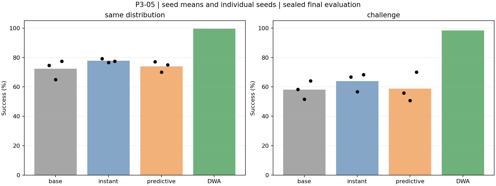
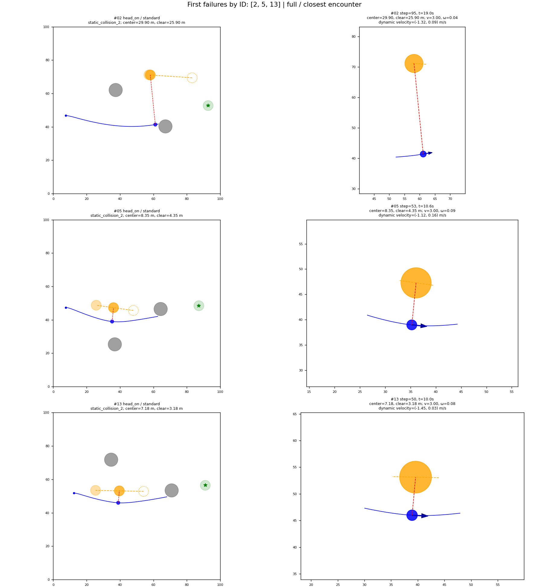
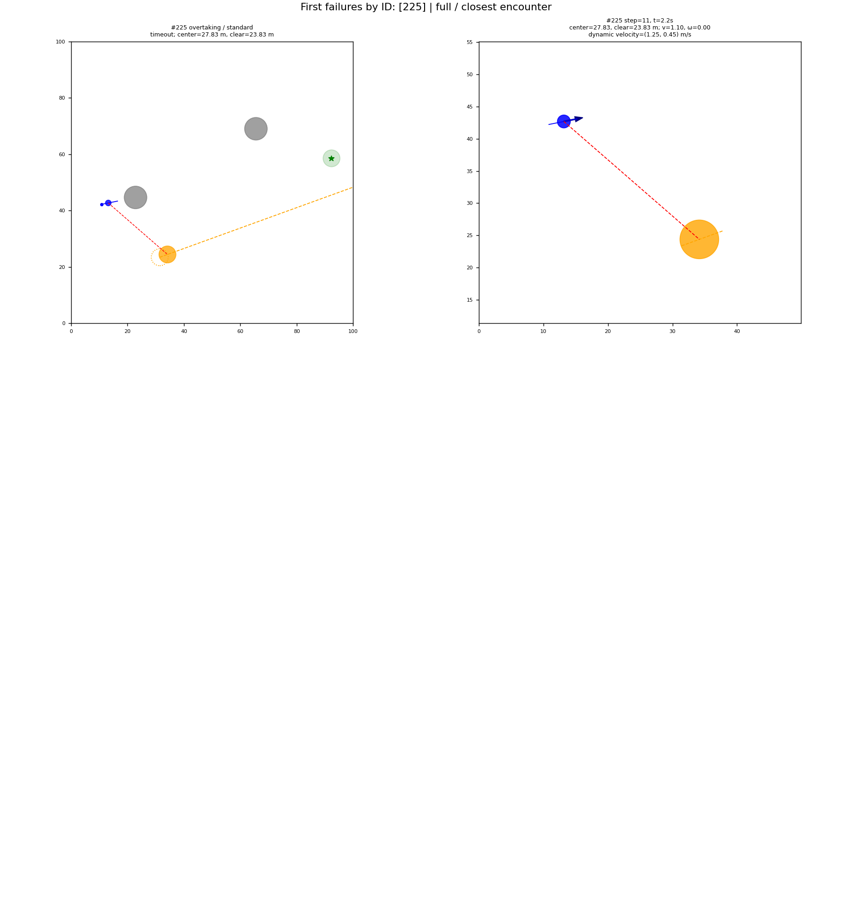

# 第三轮论文素材包

日期：2026-09-09。以下均来自已封存 P3-05 结果，属于论文撰写素材而非投稿完成稿；未新增实验、重选模型或推断新颖性。

## 1. 可用实验描述

在二维单 USV、两个静态圆障碍与一个二维匀速动态障碍的任务中，我们固定 16 维观测、网络、动力学及 PPO 超参数，比较原奖励（base）、额外即时风险惩罚（instant，H=0）与额外预测风险惩罚（predictive，H=4 s）。两个新增项共用权重 2 和净空缓冲 2 m，预测基于当前相对运动而非未来真实轨迹。每组从零训练三个配对随机 seed，每次实际 200704 步，使用共同 60 场景验证集独立选择检查点。模型冻结后生成 240 个常规与 120 个挑战场景，各自四类会遇等额，并与固定 DWA 基线共同评价。重复场景上的不同模型回合不视为独立场景样本。

## 2. 表 1：成功率

| 方法 | 常规 seed 1 / 2 / 3（%） | 常规均值 ± SD（%） | 挑战 seed 1 / 2 / 3（%） | 挑战均值 ± SD（%） |
|---|---|---|---|---|
| base | 74.58 / 65.00 / 77.50 | 72.36 ± 6.54 | 58.33 / 51.67 / 64.17 | 58.06 ± 6.25 |
| instant | 79.17 / 76.67 / 77.50 | 77.78 ± 1.27 | 66.67 / 56.67 / 68.33 | 63.89 ± 6.31 |
| predictive | 77.08 / 70.00 / 75.00 | 74.03 ± 3.64 | 55.83 / 50.83 / 70.00 | 58.89 ± 9.94 |
| DWA | 单一确定性基线，239/240 | 99.58，SD 不适用 | 单一确定性基线，118/120 | 98.33，SD 不适用 |

SD 为三个训练 seed 的样本标准差，单位为百分点，不是置信区间。原始来源：[逐 seed 指标](../results/round3/final_experiment/per_seed_metrics.csv)；seed t 区间：[seed_statistics.csv](../results/round3/final_experiment/seed_statistics.csv)。

## 3. 表 2：预定配对比较

| 数据 | 比较 | 差值（百分点） | 95% 配对层级 bootstrap 区间 |
|---|---|---:|---|
| 常规，主比较 | predictive − instant | −3.75 | [−8.89，0.84] |
| 常规，辅助 | predictive − base | +1.67 | [−4.58，7.08] |
| 常规，辅助 | instant − base | +5.42 | [−1.11，12.92] |
| 常规，辅助 | predictive − DWA | −25.56 | [−30.97，−20.00] |
| 挑战，辅助 | predictive − instant | −5.00 | [−13.33，4.44] |

训练 seed 配对，会遇类型内场景配对；10000 次重采样，统计 seed 5821。辅助比较未多重校正。来源：[全部总体及分类配对区间](../results/round3/final_experiment/paired_comparisons.json)。

## 4. 图与失败案例

### 图 1：总体成功率和训练 seed 波动

图注：两个面板分别为常规和挑战集合；柱表示 PPO 三 seed 均值，黑点为各 seed，DWA 仅一个确定性方法。此图不是训练收敛曲线。应与表 2 同时解读，不能只按柱高宣称显著提升。

### 图 2：预测组按 ID 取样的失败轨迹

图注：predictive seed 1 在常规集按 ID 排序的前三个失败为 2、5、13，均为对遇类、撞击第二个静态障碍。左列为全路径，右列为与动态障碍最近时刻的局部图；右列不是必然的碰撞时刻。静态碰撞不能被误写成动态碰撞；这三个示例也不代表全体失败构成。

### 图 3：强基线也保留失败

图注：DWA 常规 ID 225 为追越类超时，未碰撞；挑战集 ID 101、105 也为追越超时。空白图格表示不足三个失败，不是缺失结果。不能把安全停滞计为到达成功。

这些图采用既定 ID 顺序，不按视觉效果筛选。全体失败原因及 ID 见 [失败目录](../results/round3/final_experiment/failure_catalog.csv)。动态碰撞的可复核定位例如 base seed 1 常规 ID 24；对应轨迹在该评估目录 `steps.csv.gz`，不能用上面的静态失败图代替它。

## 5. 可用结果与讨论草稿

即时风险项的常规平均成功率为 77.78%，高于原奖励的 72.36%，但其配对差区间包含零。预测风险项为 74.03%，相对即时项的预定主比较为 −3.75 个百分点，95% 区间 [−8.89，0.84]，未支持预测项的可靠增益。挑战集的相应差值也没有提供正向支持。

行为统计与总体成绩共同揭示了机制限制：在满足预定首次高风险条件的 PPO 回合中，均没有随后单步降速至少 0.1 m/s 的响应，预测组在初始 2 s 后仍几乎持续满速。该阈值事件未出现不等于速度严格从未改变，也不能单独证明动作裁剪是唯一原因。预测组新增惩罚的常规/挑战平均累计值分别约为 −17.61/−22.36，高于即时组的惩罚绝对值，但没有转化为预期减速或稳定成功率收益。

因此，本实验只支持“当前固定配置下，该预测奖励没有实现预期机制”的有限结论。DWA 在两集合中表现更强，但仍有超时；不能声称本方法优于传统基线。成功子集的路径效率与到达时间存在不同存活样本，必须与全回合碰撞及超时一起报告，安全效率表可直接引用 [实验记录第 3.1 节](ROUND_THREE_EXPERIMENT.md#31-安全与效率)。

## 6. 投稿前仍需完成

- 根据目标刊会补充相关工作与新颖性核查，不将本素材包称为完整论文或已获验证的创新方法。
- 正文保留三 seed 局限、单目标匀速及无扰动假设、训练历史排重限制；明确 DWA 模型先验与参数选择来源。
- 若批准新机制实验，先冻结新协议并使用新的最终数据；本轮负结果保留为消融证据，不覆盖或从论文表格中删除。
